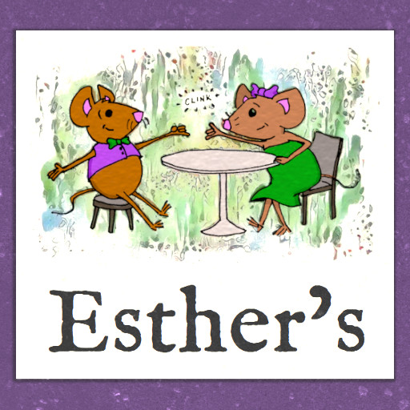

# Esther's

A Brunch Story by Alleson and Brad Buchanan

Initially released for [IFComp 2022](https://ifcomp.org).

&nbsp;

## Development

Prerequisites:

* Install [Tweego](https://www.motoslave.net/tweego/)
* Copy [Snowman](https://videlais.github.io/snowman/2/) 2.0.3 (included in this repo as the `storyformats/snowman-2.0.3` directory) into your Tweego install.
* `npm install` for test dependencies.

Build with

```
tweego src --head=head_partial.html -o index.html
```

Test with (warning, this takes a long, long time)

```
node test/full-explorations.js
```
